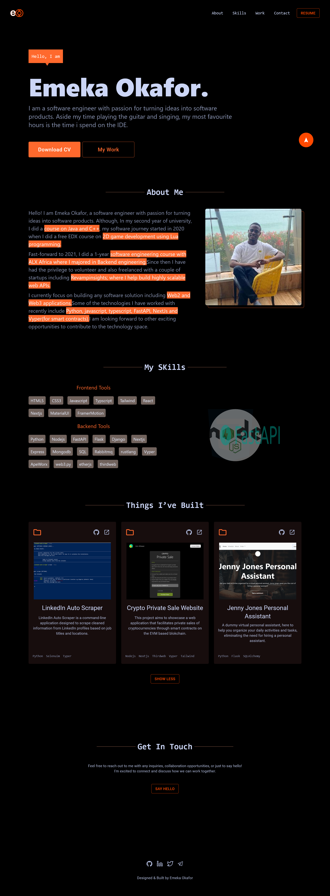

## Portfolio-Website
Portfolio website build using Reactjs.

<a href="https://my-portfolio-kenfelix.vercel.app/" target="_blank">**Visit Now** 🚀</a>

## 📌 Tech Stack

### Extras : 
framer-motoion, MaterialUI, react-icons

## 📌 Sneak Peek of Main Page 🙈 :

<h2>📬 Contact</h2>

If you want to contact me, you can reach me through below handles.

&nbsp;&nbsp;<a href="https://www.linkedin.com/in/emekakennethokafor"></img></a>

© 2023 Emeka Okafor